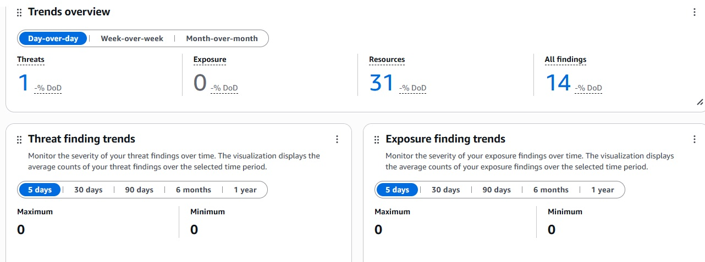
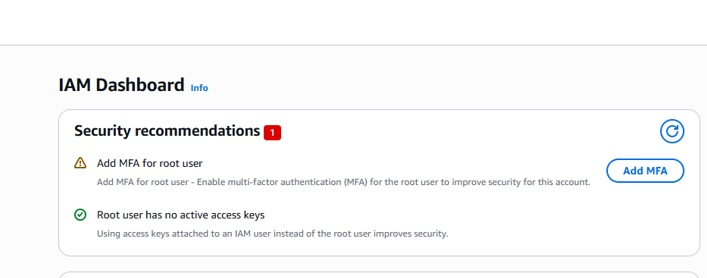
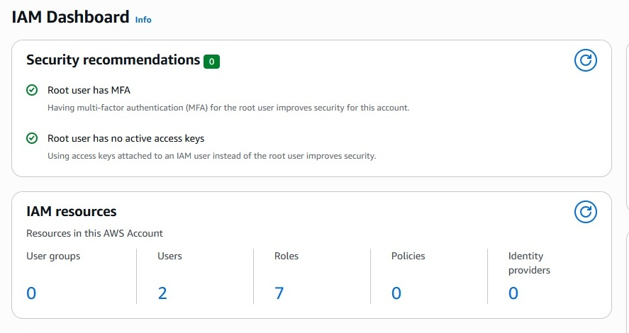
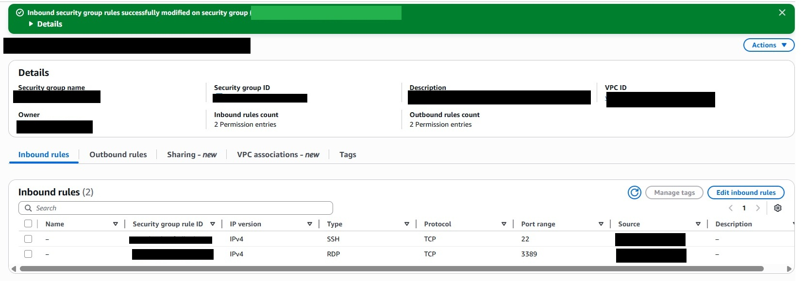
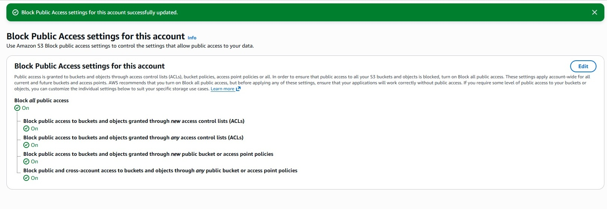

# AWS Security Hardening: 14 Findings to Zero Critical Risks

> **Status:** Critical Risks Mitigated (Achieved AWS CIS Benchmark Compliance)
> **Service:** AWS Hardening & Lockdown Pack
> **Duration:** 1 Day

## I. PROJECT SUMMARY & CONTEXT

This case study demonstrates a rapid, high-impact security intervention for a small-to-mid-sized business (SMB) client utilizing AWS. The goal was to resolve 5 critical security findings detected during the initial Security Radar Activation, preventing potential account takeover and data breach.

**Key Outcome:** All 5 high-risk vulnerabilities were resolved permanently, moving the environment to a safe, known security posture.

## II. THE PROBLEM: DANGEROUS SECURITY POSTURE (BEFORE)

Within minutes of activating our Security Radar, the AWS Security Hub reported a dangerously low security posture.

### A. Vulnerability Snapshot (The Urgent Proof)

The client's security posture was dangerously exposed, as indicated by the initial dashboard scans:

1.  **High Volume of Problems:** The initial Security Hub scan found 14 active issues.
    

2.  **Unprotected Root Account:** The Root User lacked MFA, leaving the entire account exposed.
    

### B. The 5 Critical Risks Found (Root Causes)

| Finding | Technical Issue | Business Impact |
| :--- | :--- | :--- |
| **IAM.6** | **Root User MFA Disabled** | Highest risk of **Account Takeover**. |
| **EC2.2** | **Exposed Network Ports** | SSH/RDP open to the world (`0.0.0.0/0`). Risk of **Server Hacking**. |
| **S3.2/S3.4** | **Public Data Exposure** | Public Read policy enabled on S3. Direct risk of **Data Leak**. |
| **S3.5** | **Unencrypted Data** | S3 data lacked default Server-Side Encryption. **Compliance Failure.** |
| **IAM.5** | **Inactive Access Keys** | Active, unused credentials created a potential **Backdoor Entry Point**. |

## III. REMEDIATION METHODOLOGY (THE FIX)

The environment was secured by implementing strict **Least Privilege** and **Defense-in-Depth** controls.

### A. Identity & Access Management (IAM)

* **Result:** MFA successfully enabled for Root User, resolving the highest risk.

### B. Network & Infrastructure Lockdown

* **Result:** Unrestricted network access was removed; ports 22/3389 were restricted to specific administrative IPs only.

### C. Data Protection & Cleanup

* **Result:** Block Public Access (BPA) was enforced, and Server-Side Encryption was applied. All unused test resources were securely decommissioned.

## IV. CONCLUSION & ARTIFACTS

The environment is now compliant with all critical points of the CIS AWS Foundations Benchmark.

* **Final Status:** All 5 critical findings were immediately resolved.
* **Artifacts:** We utilize Infrastructure-as-Code (IaC) solutions for robust fixes.

[View Full IaC Repository: AWS S3 Secure Bucket Configuration](https://github.com/VladimirKozin/AWS-S3-Secure-Bucket-Configuration)
